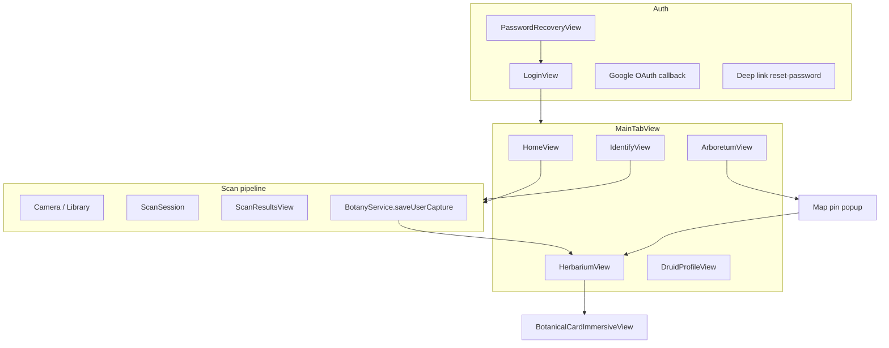

# Auditoría QA + UX — LeafID native (pre–App Store)

**Rol:** revisión tipo iOS senior + UI/UX.  
**Fecha:** 2026-05-09.  
**Alcance:** código en `LeafID-native/`, `Info.plist`, `project.pbxproj` (claves de permisos).

---

## 1. Hallazgos críticos (bloqueantes o casi bloqueantes)

| Severidad | Tema | Detalle |
|-----------|------|---------|
| **P0** | Secreto en cliente | **Mitigado (2026-05-09):** claves solo vía [`Config/Secrets.xcconfig`](../LeafID-native/Config/Secrets.xcconfig) + `Secrets.local.xcconfig` (gitignored). Rotar cualquier clave que haya estado en git histórico (OpenRouter, Gemini, Supabase anon). |
| **P0** | Coherencia legal / privacidad | Declarar en App Store Connect **todos** los destinos de datos (fotos, ubicación, cuenta, llamadas a Supabase/Plant.id/modelos si aplica). |
| **P1** | Permisos en plist “canónico” | Cámara / fotos están en `INFOPLIST_KEY_*` del **pbxproj**; el archivo `Info.plist` del target muestra sobre todo ubicación + URL schemes. Validar en **Archive** el `Info.plist` generado para no omitir claves en otro flavor. |
| **P1** | RLS / `user_id` | Según [`EXECUTION_BOARD_P0_v1.0.md`](EXECUTION_BOARD_P0_v1.0.md), producción debe tener migraciones y RLS alineados; sin eso, riesgo de datos cruzados o inserts rechazados. |

---

## 2. Mapa de superficies de producto (para QA)

---

## 3. Lista exhaustiva de flujos QA (checklist)

Marcar cada ítem en entorno **Release** (no DEBUG) salvo donde se indique.

### 3.1 Autenticación y sesión

- [ ] **Cold start con sesión válida** guardada: splash “Restoring session…” → `MainTabView` sin pedir login.
- [ ] **Cold start sin sesión** → `LoginView`.
- [ ] **Email + contraseña correctos** → entra a app; `displayName` / perfil coherente tras `hydrateSession`.
- [ ] **Email + contraseña incorrectos** → mensaje claro (no crash); no queda sesión parcial.
- [ ] **Google “Continue”** → Safari/ASWebAuthentication; callback `com.googleusercontent...://auth` → sesión activa; cancelación → error manejado.
- [ ] **Sign out** (Druid) → vuelve a login; tokens limpiados; no se puede acceder a tabs.
- [ ] **Sesión expirada / token inválido** (si está implementado refresh): comportamiento explícito o mensaje al usuario.

### 3.2 Recuperación de contraseña

- [ ] **Supabase Dashboard → Auth → URL configuration:** en **Additional Redirect URLs** incluir exactamente `com.marianaminafro.leafid://reset-password` (si no está en la allow list, GoTrue rechaza el `redirect_to` y el enlace del correo no abre la app o el API devuelve error legible en la UI).
- [ ] **Solicitar reset** desde login: email válido → confirmación / sheet; email inválido → error.
- [ ] **Email de Supabase** abre enlace que redirige a **`com.marianaminafro.leafid://reset-password`** con tokens en fragment/query según configuración Supabase.
- [ ] **App en frío** al abrir el enlace: `onOpenURL` → `PasswordRecoveryView` / flujo `isInPasswordRecovery`.
- [ ] **App en caliente** mismo escenario.
- [ ] **Nueva contraseña** &lt; 8 caracteres → error; ≥ 8 → éxito y salida del flujo recuperación.
- [ ] **Token expirado** al actualizar contraseña → mensaje “Recovery session expired…” y camino para pedir nuevo mail.
- [ ] **Salir de recuperación** (`exitPasswordRecovery`) → no deja la app en estado incoherente.

### 3.3 Identify → resultados → Preserve → Herbarium

- [ ] **Sin claves Supabase** (identify “offline”): flujo demo u error explícito; no pantalla colgada.
- [ ] **Con identify live**: foto válida → resultado con nombre, familia, narrativa, **cultural legacy** rellenado o fallback.
- [ ] **Preserve** con imagen: insert local + opcional Supabase Storage + fila REST; error de red **visible** (no silencioso).
- [ ] Tras guardar: espécimen **arriba del todo** en Herbarium; **no** mezclar con catálogo placeholder (comportamiento `appendPreservedScan`).
- [ ] **Re-identificar misma foto** (cache perceptual): resultado coherente con caché documentada.

### 3.4 Ubicación de captura y consistencia en UI

Probar **cámara** y **biblioteca** (con y sin EXIF GPS).

- [ ] Al guardar: `latitude` / `longitude` / `locality` persistidos en `Scan` según [`BotanyService.saveUserCapture`](LeafID-native/Services/BotanyService.swift) y [`Scan.captureLocationLine`](LeafID-native/Models/Scan.swift).
- [ ] **Herbarium list row**: muestra `captureLocationLine` (y no solo `location` obsoleto).
- [ ] **CompactSpecimenCard / Last Found** (Home): misma línea de lugar + GPS si aplica.
- [ ] **BotanicalCardDetailView / Immersive**: lugar + coordenadas alineados con el modelo.
- [ ] **ScanResultsView** (pre-guardar): preview de lugar coherente con `captureLocality` / EXIF / dispositivo.
- [ ] **Arboretum**: pin solo si hay coordenadas; recenter “all specimens” y “mi ubicación” con permiso concedido/denegado.
- [ ] **Permiso ubicación denegado**: mapa usable; mensaje al recenter usuario si no hay fix; opción Settings si aplica.
- [ ] **Reverse geocode diferido** (`patchPreservedScan`): tras mejorar `locality`, lista y tarjetas reflejan el update al reabrir o al vivir en memoria.

### 3.5 Herbarium (colección)

- [ ] Lista vacía → empty state copy correcto.
- [ ] Tap fila → `BotanicalCardImmersiveView` con matched geometry razonable.
- [ ] Cerrar inmersive → vuelve a lista; scroll/header estable.
- [ ] **Desde Arboretum**: pin → popup → tap fila → tab Herbarium + misma ficha; cerrar ficha → **vuelta a Arboretum** si el flujo lo define.
- [ ] Persistencia: kill app → mismos `scans` (UserDefaults); backup/restore dispositivo (opcional).

### 3.6 Arboretum

- [ ] Gestos mapa: pan, pinch, rotación si está habilitada.
- [ ] Controles +/− / hoja / ubicación: respuesta inmediata.
- [ ] Tap fuera del popup → cierra overlay; solo mapa + dots.
- [ ] Sin pins geolocalizados → banner informativo.

### 3.7 Home e Identify (duplicidad de flujo)

- [ ] **Home**: galería, cámara (si existe), último hallazgo, navegación a scan/immersive según implementación.
- [ ] **Identify tab**: mismos pickers; paywall si `isPremium` / límites; **DEBUG**: botones de stress test **no** en Release.

### 3.8 Druid (perfil)

- [ ] Stats / logros (`Achievements`, `ProfileStatsLocalStore`) con datos reales tras N saves.
- [ ] Enlaces externos (privacidad, soporte) abren correctamente.
- [ ] **PaywallView**: compra restaurada / cancelada; no bloquea app en estado roto.
- [ ] **Foundry gate** en [`ProfileView`](LeafID-native/Views/Druid/ProfileView.swift) (contraseña “Test”): confirmar **oculto o deshabilitado en Release** si no es para usuarios finales.

### 3.9 Red y resiliencia

- [ ] Modo avión en identify → error + retry o mensaje.
- [ ] Timeout Supabase → UI no congela indefinidamente.
- [ ] Payload imagen grande → identify no OOM (probar en dispositivo real antiguo).

### 3.10 App Store / binario

- [ ] **Archive Release**: sin banner DEBUG (Arboretum location debug).
- [ ] Bitcode/symbols según política actual Apple.
- [ ] **Privacy Manifest** si añades SDKs que lo requieran.
- [ ] Cumplimiento **Guideline 5.1.1** (datos sensibles) y **AI** si narrativas son generativas.

### 3.11 Acciones y controles (auditoría global — backlog)

Pasada sistemática **después** del QA funcional principal: localizar controles que *parecen* interactivos pero no hacen nada (o no dan feedback).

- [ ] **Inventario**: repasar `LeafID-native/**/*.swift` — `Button`, `NavigationLink`, `.onTapGesture`, filas en `List`/`ScrollView`, y texto con estilo “enlace” (`foregroundStyle(primary)`, subrayado implícito) que sugiera tap.
- [ ] **Criterio de fallo**: tap sin acción observable, sin navegación, sin sheet/alert, y sin `disabled` + explicación accesible cuando corresponda.
- [ ] **Corrección**: convertir en `Button` real, enlazar acción, o rebajar estilo visual (solo texto secundario) para no sugerir interacción.
- [ ] **VoiceOver / accesibilidad**: elementos accionables con `accessibilityHint` o rol coherente; no exponer como botón si no lo son.
- [ ] Documentar hallazgos en este doc o en un issue breve por pantalla.

---

## 4. Mejoras de interacción y UI (recomendaciones)

Prioridad sugerida: **P0** impacto alto / esfuerzo razonable; **P1** pulido; **P2** nice-to-have.

### 4.1 Feedback y estados de sistema

| Pri | Mejora |
|-----|--------|
| P0 | **Toasts o banners** para éxito/error tras Preserve, fallo de red, y reset de contraseña enviado (hoy parte del feedback puede quedar solo en `lastError` poco visible). |
| P0 | **Loading accesible**: `ProgressView` + `accessibilityLabel` en identify, OAuth, y restore session. |
| P1 | **Haptics** ligeros en Preserve exitoso y en error de identify (`.notificationOccurred`). |
| P1 | **Retry** explícito en pantallas de error de red (un solo botón “Reintentar”). |

### 4.2 Autenticación

| Pri | Mejora |
|-----|--------|
| P0 | Tras **Google OAuth**, indicar “Conectando…” mientras `isHandlingOAuthCallback` (evitar doble tap). |
| P1 | **Password reset**: confirmación “Revisa tu correo” con siguiente paso (revisar spam, etc.). |
| P1 | Soporte **Dynamic Type** en campos de login/recuperación (revisar límites de altura y `minimumScaleFactor` donde haga falta). |

### 4.3 Scan e Identify

| Pri | Mejora |
|-----|--------|
| P0 | **Pre-permisos**: pantalla corta “Por qué cámara/ubicación” antes del primer `UIImagePickerController` / `CLLocationManager` mejora aceptación (copy ya en execution board como backlog). |
| P1 | En resultados, **jerarquía visual** clara: nombre común → científico → confianza → acción primaria “Save”. |
| P1 | Si identify tarda &gt; ~2s, **skeleton** o progreso indeterminado en zona de resultado. |
| P2 | **Arrastrar para cerrar** en sheets de resultados si se usan modales tipo sheet. |

### 4.4 Ubicación y mapa

| Pri | Mejora |
|-----|--------|
| P1 | Cuando el pin del mapa abre la fila tipo Herbarium, **animación** de entrada del dimming + card (ya hay overlay; pulir curva y duración). |
| P1 | **Indicador** “ubicación aproximada” vs EXIF en resultados si mezclas fuentes (reduce desconfianza del usuario). |
| P2 | Mapa: **leyenda mínima** (punto = tu colección) la primera vez. |

### 4.5 Herbarium e inmersivo

| Pri | Mejora |
|-----|--------|
| P1 | **Pull-to-refresh** si en el futuro hay sync remota; hoy lista local — documentar que no hay sync en UI. |
| P1 | En tarjeta inmersiva, **gesto swipe down** para cerrar — implementado en [`BotanicalCardImmersiveView`](LeafID-native/Views/Herbarium/BotanicalCardImmersiveView.swift) (arrastre vertical hacia abajo). |
| P2 | Transición compartida desde lista: cuando `immersiveUseMatchedGeometry == false` (desde mapa), **fade escalonado** para no chocar con expectativa de “hero”. |

### 4.6 Accesibilidad

| Pri | Mejora |
|-----|--------|
| P0 | Revisar **VoiceOver** en mapa (pins, popup, botones de zoom). |
| P0 | Contraste de texto sobre **verde lima** (`primary`) en fondos claros/oscuros (WCAG donde aplique). |
| P1 | **Reduce Motion**: respetar `UIAccessibility.isReduceMotionEnabled` en animaciones largas (`leafIDSpring`, flip de carta). |

### 4.7 Contenido y tono

| Pri | Mejora |
|-----|--------|
| P1 | Unificar **voz de marca** (“The Druid”, “Herbarium”, “Arboretum”) en todos los empty states. |
| P1 | Revisar strings en **inglés** para App Store global; planificar localización ES si el mercado principal es hispanohablante. |

### 4.8 Druid — logros (achievements) — backlog

| Pri | Mejora |
|-----|--------|
| P1 | **Cobertura end-to-end**: asegurar que *todos* los achievements definidos en el passport Druid tienen (a) **datos persistidos o derivables** cuando el usuario cumple la condición, y (b) **tracking explícito** (recomputar al vuelo y/o eventos) para detectar el momento en que se desbloquean. |
| P1 | **Fuente de verdad**: ~~UI Druid~~ usa el mismo catálogo que [`Achievements.swift`](../LeafID-native/Services/Achievements.swift) vía `AchievementUnlockStore` + `herbarium.scans` (sin demo). Revisar que **rank/energy** (`DruidProfileViewModel` / UserDefaults) queden alineados con colección real en una iteración futura. |
| P2 | **Sync futuro**: si los logros pasan a Supabase, documentar migración de `UserDefaults` / unlock IDs y conflictos multi-dispositivo. |

**Criterio de hecho:** cada achievement tiene trazabilidad clara: *qué métrica lo alimenta*, *cuándo se evalúa* (p. ej. tras Preserve, al abrir Druid, al cargar Herbarium), y *prueba manual* en checklist §3.x cuando exista flujo asociado.

### 4.9 Cerrar modales y sheets — solo botón “cruz” (design system) — backlog

**Decisión (canónico):** usar **[`ModalCloseButton`](../LeafID-native/UI/System/ModalCloseButton.swift)** como control estándar de cierre en **sheets, modales y barras de navegación** (círculo 44×44pt, material, `xmark`). Reservar **[`GlassChromeCircleButton`](../LeafID-native/UI/System/GlassChromeCircleButton.swift)** con `xmark` solo donde el layout inmersivo / cromo de tarjeta ya lo exige (p. ej. detalle botánico a pantalla completa).

| Pri | Mejora |
|-----|--------|
| P1 | **Unificar patrón de cierre**: sustituir textos “Close” / `Button("Close")` restantes por **`ModalCloseButton`** (o `GlassChromeCircleButton` solo en inmersivos). Hecho: sheet **Recover password**; **Scanner** (`xmark` + `ModalCloseButton` en error cámara). Revisar otros sheets al pasar §3.11. |
| P1 | **Layout**: hit target cómodo (mín. ~44pt donde aplique) **sin** solapar títulos, scroll ni CTAs; usar `safeAreaInset`, alineación trailing consistente, y padding que no “rompa” el contenido en Dynamic Type. |
| P2 | **Accesibilidad**: mantener `accessibilityLabel` “Close” (o string localizado) en el control unificado. |

**Inventario inicial (no exhaustivo):** ~~Recover sheet~~, ~~Scanner~~. Quedan: [`BotanicalCardDetailView`](../LeafID-native/Views/Herbarium/BotanicalCardDetailView.swift) (evaluar unificar con `ModalCloseButton` donde no haya cromo), otros sheets sueltos.

---

## 5. Plan de ejecución sugerido (orden)

1. **P0 seguridad:** retirar clave OpenRouter literal del repo y del binario; rotar clave en proveedor.
2. **P0 QA crítico:** auth completo + identify preserve + ubicación end-to-end + Arboretum/Herbarium cross-nav.
3. **P1:** matrices de dispositivo iOS mínimo y último iOS; permisos denegados; modo avión.
4. **P1 UX:** feedback post-acción (Preserve, errores red), loading OAuth, Dynamic Type spot-check.
5. **P1 consistencia:** auditoría global de botones/controles que no disparan acción (checklist §3.11 + fila en §4.1); ejecutar cuando el resto de QA estable esté verde.
6. **P1 Druid + UI (backlog):** logros trackeados y desbloqueables con datos reales (§4.8); cierre de modales unificado a cruz + design system sin pisar contenido (§4.9).
7. **Pre-submisión:** actualizar [`APP_STORE_LAUNCH_CHECKLIST.md`](APP_STORE_LAUNCH_CHECKLIST.md) enlazando este doc; rellenar App Privacy y notas de revisión.

---

## 6. Referencias en código (ancla rápida)

- Auth / deep links: [`LeafID_nativeApp.swift`](../LeafID-native/LeafID_nativeApp.swift)
- Tabs y deep link Herbarium: [`MainTabView.swift`](../LeafID-native/Views/MainTabView.swift)
- Identify + resultados: [`IdentifyView`](LeafID-native/Views/Identify/IdentifyView.swift), [`ScanResultsView`](LeafID-native/Views/Identify/ScanResultsView.swift)
- Persistencia y API: [`BotanyService.swift`](LeafID-native/Services/BotanyService.swift)
- Herbarium: [`HerbariumView`](LeafID-native/Views/Herbarium/HerbariumView.swift), [`HerbariumViewModel`](LeafID-native/ViewModels/HerbariumViewModel.swift)
- Mapa: [`ArboretumView`](LeafID-native/Views/Arboretum/ArboretumView.swift)
- Druid / logros: [`DruidProfileView`](LeafID-native/Views/Druid/DruidProfileView.swift), [`Achievements.swift`](LeafID-native/Services/Achievements.swift)
- Cierre modal (design system): [`ModalCloseButton`](LeafID-native/UI/System/ModalCloseButton.swift), [`GlassChromeCircleButton`](LeafID-native/UI/System/GlassChromeCircleButton.swift), galería [`DesignSystemGalleryView`](LeafID-native/UI/Gallery/DesignSystemGalleryView.swift)
- Permisos build: `LeafID-native.xcodeproj/project.pbxproj` (`INFOPLIST_KEY_*`)

---

## 7. Progreso reciente (implementación en código)

Actualizar este apartado cuando se cierren ítems del plan; el checklist §3 sigue siendo la fuente de verdad para **pruebas manuales**.

| Área | Estado |
|------|--------|
| **§4.8 Achievements (Druid)** | [`DruidProfileView`](LeafID-native/Views/Druid/DruidProfileView.swift) usa [`AchievementUnlockStore.tiles`](LeafID-native/Services/Achievements.swift) con colección real (`herbarium.scans`); el catálogo demo **no** desbloquea logros. [`ProfileView`](LeafID-native/Views/Druid/ProfileView.swift) alineado con el mismo criterio para tiles. |
| **§3.8 Foundry** | Entrada Foundry (footer, sheets, galería) y engranaje en header Druid solo en **DEBUG**; ausente en Release. |
| **§4.9 Cierre modal** | Sheet recuperación: `ModalCloseButton`. [`ScannerView`](LeafID-native/Views/Identify/ScannerView.swift): cierre con `xmark` + `ModalCloseButton` en overlay de error de cámara. Inmersivo botánico: sigue `GlassChromeCircleButton` + **gesto swipe down** para cerrar. |
| **§4.1 / §4.2 Auth UX** | `ProgressView` con `accessibilityLabel` (restaurar sesión, OAuth); botón Google deshabilitado durante `isHandlingOAuthCallback`; mensaje post-reset con spam/promociones. |
| **Colección → Druid** | `NotificationCenter` [`herbariumCollectionDidChange`](LeafID-native/LeafID_nativeApp.swift) tras persistir Herbarium; Druid hace `refresh()` del view model al recibirla. |
| **§3.2 Recuperación / mail** | Puente GitHub Pages [`index.html`](../index.html): Supabase **Redirect URLs** incluye esa URL HTTPS + `com.marianaminafro.leafid://reset-password`. App: `PASSWORD_RESET_REDIRECT` en xcconfig → Info.plist → `passwordResetRedirectURI` en recover. |
| **Cuota free tier / Druid** | [`ProfileStatsLocalStore.scansForFreeTierGate`](LeafID-native/Services/ProfileStatsLocalStore.swift) alinea Identify/Home con lifetime local + `@AppStorage`; Druid rank/energy ya usa `max` con herbario en [`DruidProfileViewModel`](LeafID-native/ViewModels/DruidProfileViewModel.swift). |
| **§4.1 feedback** | Tras **Save to Herbarium** en [`ScanResultsView`](LeafID-native/Views/Identify/ScanResultsView.swift): haptic éxito / error (`UINotificationFeedbackGenerator`). |
| **§4.9 / §3.11** | Sheet ajustes en [`ProfileView`](LeafID-native/Views/Druid/ProfileView.swift): cierre con `ModalCloseButton`. |
| **Paywall / §3.11** | [`PaywallView`](LeafID-native/Views/Druid/PaywallView.swift): `ModalCloseButton` + copy de que IAP aún no está conectado; light haptic en CTA. |
| **Identify errores** | [`BotanyServiceError`](LeafID-native/Services/BotanyService.swift) conforma `LocalizedError`; [`ScannerAnalyzeView`](LeafID-native/Views/Identify/ScannerView.swift) muestra mensaje útil (truncado) + haptic error; **Retry** ya existía. |
| **Home empty “Last Found”** | Sin chevron que sugería fila tappable ([`HomeEmptyLastFoundCard`](LeafID-native/Views/Home/HomeView.swift)). |

**Pendiente típico (sigue en §3–§6):** pruebas Release en dispositivo, toasts globales, retry de red, pre-permisos, VoiceOver mapa, Dynamic Type exhaustivo, RLS Supabase, ítems legales App Store.

---

*Fin del documento. Actualizar tras cada release candidate.*
